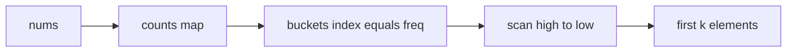

# LC 347 桶排序解题思路

核心文件：
- 参考解（桶排序）：[`go/topkfrequent.go`](go/topkfrequent.go)、[`java/TopKFrequent.java`](java/TopKFrequent.java)
- 笔记：[`NOTES.md`](NOTES.md)
- 你当前 Java 练习是**最小堆**写法（O(n log k)），Go practice 仍是 TODO；下面专讲仓库主解法——桶排序。

---

## 问题本质

要从 `nums` 里找出「出现次数最高的 k 个不同元素」。

拆成两步：

1. **计数**：每个值出现几次
2. **按频次取前 k**：谁的次数更大谁优先

第 2 步常见三档：

| 方案 | 时间 | 要点 |
|------|------|------|
| 排序 | O(n log n) | 按频次降序，取前 k |
| 最小堆 | O(n log k) | 堆大小维持 k（你 Java practice 正是这个） |
| **桶排序** | **O(n)** | 频次本身当下标，不比较排序 |

桶排序能到 O(n) 的关键洞察：**任一元素出现次数最多是 n（全数组都是它），所以频次值域天然有界：`1 .. n`。**

---

## 桶排序三步（对照 Go 参考解）

```3:18:algo/problems/0347-top-k-frequent-elements/go/topkfrequent.go
func TopKFrequent(nums []int, k int) []int {
	counts := make(map[int]int, len(nums))
	for _, x := range nums {
		counts[x]++
	}
	buckets := make([][]int, len(nums)+1)
	for x, c := range counts {
		buckets[c] = append(buckets[c], x)
	}
	res := make([]int, 0, k)
	for c := len(buckets) - 1; c > 0 && len(res) < k; c-- {
		res = append(res, buckets[c]...)
	}
	return res[:k]
}
```

### Step 1：计数 → `map[值]频次`

`nums = [1,1,1,2,2,3]` →

```
1 → 3
2 → 2
3 → 1
```

### Step 2：建桶，下标 = 频次

开 `n+1` 个桶（必须 `+1`：全相同元素时频次 = n，要能写到 `buckets[n]`）。

```
buckets[0] = []        // 不用，没有「出现 0 次」的值进 map
buckets[1] = [3]
buckets[2] = [2]
buckets[3] = [1]
buckets[4..] = []
```

含义：`buckets[c]` = 「所有刚好出现 c 次的值」。这不是按值排序，而是**按频次归桶**。



### Step 3：从高频桶往低频桶扫，收满 k 个

从 `c = n` 往下扫到 `1`：

- `c=3` → 收 `1` → 已有 1 个
- `c=2` → 收 `2` → 已有 2 个 = k，停
- 结果 `[1, 2]`

同一桶里可能有多个值（频次相同）；题目保证答案唯一，但实现上仍可能一桶多个把结果推过 k，所以要截断：Go 用 `res[:k]`，Java 内层 `if (idx == k) return`。

---

## 和堆写法的对比（你现在的 Java practice）

[`java/TopKFrequentPractice.java`](java/TopKFrequentPractice.java) 当前是：

1. 同样先计数
2. 用大小为 k 的**最小堆**（堆顶是当前 top-k 里频次最低的）
3. 超过 k 就弹出堆顶

堆在「只关心前 k、且 k ≪ n」时很实用，但每次数操作带 `log k`。桶排序把比较排序换成「下标即排序键」，整体线性。

面试话术可以是：先说堆 O(n log k)，追问「能否更优」再给桶 O(n)。

---

## 易错点（写练习时盯住）

1. 桶长度是 **`n+1`**，不是 unique 个数
2. 从高往低扫，别从低往高
3. 一桶多个时可能超 k → 截断
4. 题目不要求输出顺序；测试会先 sort 再比（map 迭代序不稳定）

---

## 建议你自己写时的落点

目标复杂度注释已写明：O(n)/O(n)。Go practice 的 TODO、以及若要把 Java practice 改成桶排序，都按上面三步镜像参考解即可：

1. `counts`
2. `buckets[freq].add(value)`
3. `for (freq = n; freq >= 1; freq--)` 收集直到 k

不需要改仓库文件；这是纯思路梳理。若你确认后想进入 Agent 模式，我可以按同样结构带你对照源码逐行走读，或帮你把 practice 改成桶排序并跑测试。
